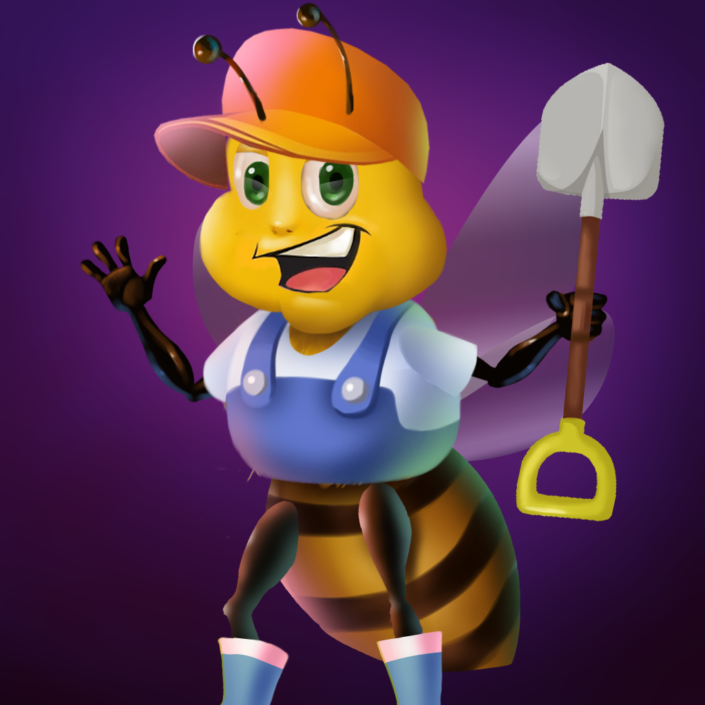
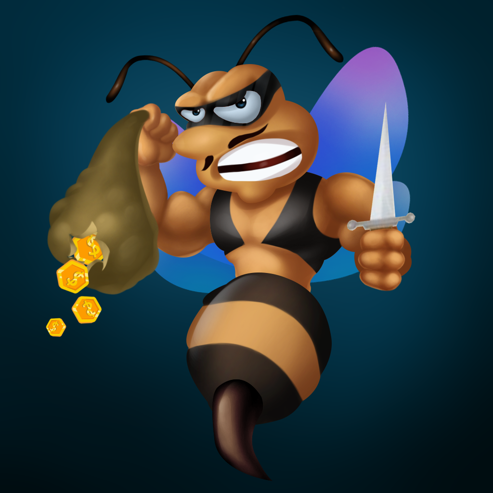

# Bee NFTs

### **Queen Bee**&#x20;

This is the rarest Bee within TheHexagon.

The Queen Bee holder can mint Worker Bee NFTs to replace those killed by Gang Bees. (500 $HONEY per NFT)

### **Worker Bee**

Worker Bees get honey ($HONEY token) from Flowers (NFT Staking Dapp).

Occasionally, 1% of Worker Bees are killed by Gang Bees.

### Gang Bee

Gang Bees rob honey when Worker Bees harvest $HONEY from staking.

Learn more on [nft-staking.md](nft-staking.md "mention").

### Army Bee

Army Bees protect the $HONEY of Worker Bees from the Gang Bees.

Learn more on [nft-staking.md](nft-staking.md "mention").

.png>)
