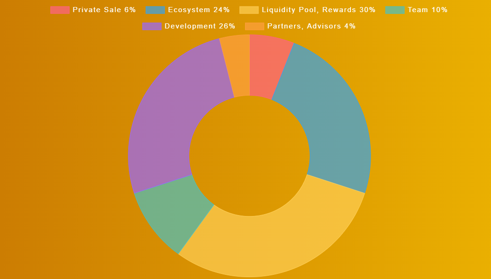

# Game Hexagon

Making a game hexagon will also be relatively simple, with a decent degree of customizability.  The renter/owner of the hexagon would first select the [game](../bee-games.md) that he wants to be in his hexagon and then the settings.  The first option is pay-to-play, meaning that the user just has to pay a certain amount of $Honey to play the game.  If he then passes a certain goal set by the owner, then he can win $Honey or a Bee NFT (based on what the owner wants the reward to be).  The second option is a "gamble for victory" concept.  For this, the user would bet/or match a bet on themselves winning a game.  If it is one of the single player games, the player's score would be compared to a random player playing at around the same time.  The last option is the free option where the user is not required to have any $Honey to participate in the hexagon.
